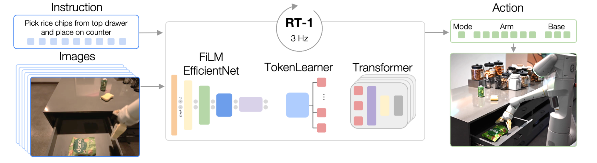

# Google RT-1 Finetuning and Inference with JAX

This repository provides a JAX-based implementation for fine-tuning and inference with Google's [RT-1-X model](https://robotics-transformer-x.github.io/). It supports custom environments for fine-tuning and inference and includes integration with the MetaWorld environment.

## Features
- **Fine-tuning**: Easily fine-tune the RT-1 model using custom datasets.
- **Inference**: Run inference in custom environments.
- **Environment Integration**: Pre-integrated with the MetaWorld environment.

---

## Model Overview


The RT-1 model is a versatile architecture designed for robotics tasks, making it ideal for various real-world scenarios.

---

## RT-1-X jax checkpoint
A jax checkpoint that can be used by the flax checkpoint loader can be downloaded by
```bash
gsutil -m cp -r gs://gdm-robotics-open-x-embodiment/open_x_embodiment_and_rt_x_oss/rt_1_x_jax .
```

## Fine-tuning

### Customizing Datasets
Fine-tuning uses datasets in the RLDS format. To create or modify datasets:
1. Refer to the `data/datasets.py` file to define your custom dataset.
2. Use RLDS-compatible tools for dataset preparation. For example, you can refer to the data collection script from the RLDS Dataset Builder repository: [rlds_dataset_builder](https://github.com/kpertsch/rlds_dataset_builder).

### Running Fine-tuning
Once your dataset is ready, execute the following command:
```bash
python train.py
```

---

## Inference

### Customizing Environments
To customize environments for inference:
1. Define your custom environment in the `envs/` directory.
2. Integrate the environment into `eval.py` for inference.

### Running Inference
After integrating your environment, execute the following command:
```bash
python eval.py
```

---

## Environment Integration
This repository is pre-integrated with the MetaWorld environment. Additional environments can be added by following the instructions in the `envs/` directory.

---

## Requirements
- JAX
- RLDS
- Python 3.10

Install the required dependencies:
```bash
pip install -r requirements.txt
```

Install jax for GPU
```bash
pip install --upgrade "jax[cuda11_pip]==0.4.20" -f https://storage.googleapis.com/jax-releases/jax_cuda_releases.html
```

Install jax for TPU
```bash
pip install --upgrade "jax[tpu]==0.4.20" -f https://storage.googleapis.com/jax-releases/libtpu_releases.html
```

---

## Directory Structure
```
.
├── data
│   ├── datasets.py  # Custom dataset definitions
├── envs
│   ├── metaworld    # MetaWorld environment integration
│   └── ...          # Add your custom environments here
├── train.py         # Fine-tuning script
├── eval.py          # Inference script
└── requirements.txt # Python dependencies
```

---

## References
- [RLDS Dataset Builder](https://github.com/kpertsch/rlds_dataset_builder)
- [MetaWorld](https://github.com/Farama-Foundation/Metaworld)


---

## Acknowledgments
Thanks to Google for the RT-1 model and the robotics research community for inspiration and tools.

